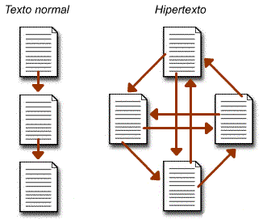
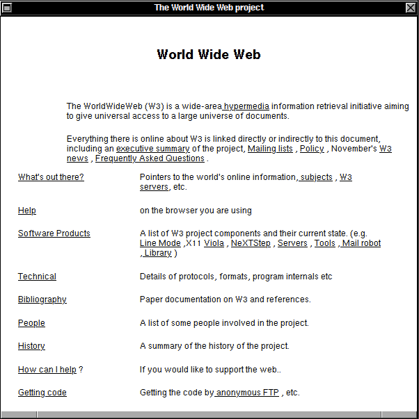
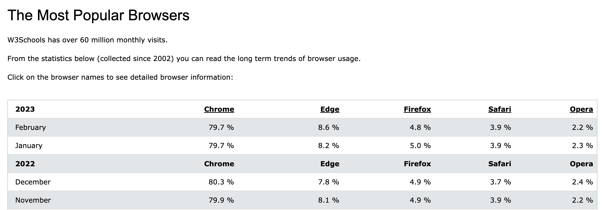
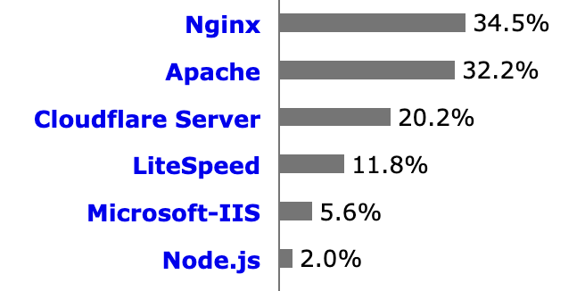

<!-- _paginate: false -->
# **Desenvolvimento de Sistemas para a Web I**

## Capítulo 1 - Introdução a Web

---

## Motivação

- Tim Berners-Lee, membro do CERN (Conseil Européen pour la Recherche Nucléaire), queria um sistema para tornar mais fácil o compartilhamento de documentos de pesquisas pela Internet
- Criou um sistema de documentos baseados em **hipertexto**
- O **hipertexto** é uma forma de **hipermídia**
- **Hipermídia** é a *fusão* de várias mídias (texto, áudio, vídeo, etc.) num ambiente computacional, suportada por sistemas eletrônicos de comunicação

---

## Motivação

- **Hipertexto** é o termo que remete a um texto ao qual se agregam outros conjuntos de informação na forma de blocos de textos, palavras, imagens ou sons, cujo acesso se dá através de referências específicas, no meio digital denominadas **hiperligações**
- **Hiperligação** (em inglês, hyperlink ou link), é uma referência dentro de um documento em hipertexto a outras partes desse documento ou a outro documento

---

## Motivação

---

## Motivação

- Tim Berners-Lee criou um programa para visualizar os hipertextos (navegador ou browser), uma linguagem de marcação (HTML), um protocolo para distribuição (HTTP) e um servidor de documentos (páginas)
- CERN / Tim Berners-Lee distribuiram estas especificações/softwares pela Internet
- Nasceu assim a World Wide Web (Teia de Alcance Mundial), ou simplesmente, Web

---

## Motivação

- Primeira página web: http://info.cern.ch/hypertext/WWW/TheProject.html
- Primeiro navegador (chamava-se WorldWideWeb):

---

## Navegador (Browser)

- Programa para interpretar as tags e exibir corretamente a aparência de uma página Web
- Atualmente os mais populares são:
  - Chrome (Google)
  - Firefox (Mozilla Foundation)
  - Edge / Internet Explorer (Microsoft)
  - Safari (Apple)
  - Opera (Opera Software)

---

## Navegador (Browser)

- Fonte: https://www.w3schools.com/browsers/default.asp

---

## Servidores Web (HTTP)

- Programa para interpretar as requisições HTTP, localiza o recurso (página, áudio, vídeo, etc) e devolve uma resposta
- Os servidores web mais populares são:
  - Nginx (lê-se "engine x")
  - Apache
  - Cloudflare Server
  - LiteSpeed
  - Microsoft-IIS

---

## Servidores Web (HTTP)

- Fonte: https://w3techs.com/technologies/overview/web_server

---

## HTML

- HyperText Markup Language (Linguagem de Marcação de Hipertexto)
- **Linguagem de marcação** utilizada na construção de páginas Web
- Uma **linguagem de marcação** é um conjunto de sinais (tags) aplicados nos textos ou em dados para definir sua configuração e aparência em uma página Web
  - Exemplo: `<title>`Minha página`</title>`

---

## HTTP

- HyperText Transfer Protocol (Protocolo de Transferência de Hipertexto)
- Descrição do protocolo: RFC2616 - https://www.rfc-editor.org/rfc/rfc2616
- Modelo Cliente-Servidor
  - O cliente faz uma requisição (request)
  - O servidor responde (response) a requisição
- O ínicio da comunicação sempre parte do cliente
- O servidor sempre aguarda e responde as requisições

---

## Referências Biográficas

- Wikipedia, "World Wide Web", https://pt.wikipedia.org/wiki/World_Wide_Web, acessado em 30/03/2023
- Wikipedia, "HTML", https://pt.wikipedia.org/wiki/HTML, acessado em 30/03/2023
- Wikipedia, "Linguagem de marcação", https://pt.wikipedia.org/wiki/Linguagem_de_marca%C3%A7%C3%A3o, acessado em 30/03/2023

---

## Referências Biográficas

- Wikipedia, "Hipertexto", https://pt.wikipedia.org/wiki/Hipertexto, acessado em 30/03/2023
- Wikipedia, "Hiperligação", https://pt.wikipedia.org/wiki/Hiperliga%C3%A7%C3%A3o, acessado em 30/03/2023
- Wikipedia, "Tim Berners-Lee", https://en.wikipedia.org/wiki/Tim_Berners-Lee, acessado em 30/03/2023

---

## Referências Biográficas

- Wikipedia, "Hipermídia", https://pt.wikipedia.org/wiki/Hiperm%C3%ADdia, acessado em 30/03/2023
- Contemporaneidade,Tecnologi@ e Educação, "Texto linear ou Hipertexto?", http://4.bp.blogspot.com/-UdBjepDgUW8/UbyZtY2_-yI/AAAAAAAAADY/wiFfW55kC3A/s1600/hipertexto-21.png, acessado em 30/03/2023
- Wikipedia, "Hipertext Transfer Protocol", https://pt.wikipedia.org/wiki/Hypertext_Transfer_Protocol, acessado em 30/03/2023
