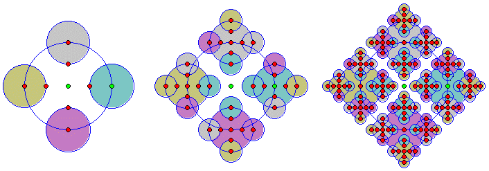
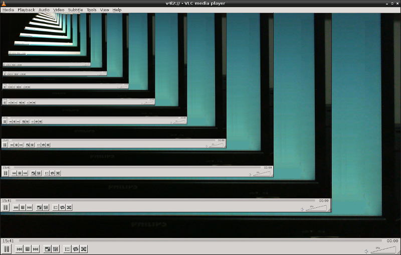

<style>
img[alt~="center"] {
    display: block;
    margin: 0 auto;
}

td {
  white-space: nowrap;
}
</style>

<!-- _paginate: false -->
# **Desenvolvimento de Sistemas para a Web I**

## Capítulo 10 - Introdução à Linguagem JavaScript (JS)

---

## Algumas Características de JavaScript

- Umas das tecnologias fundamentais da WWW (junto com HTML e CSS)
- Linguagem de alto nível e multi-paradigma
- Sintaxe semelhante a linguagem C
- Interpretada (na verdade compilada Just-in-Time (JIT))
- Tipagem dinâmica
- Não confundir a linguagem JavaScript com Java

---

## Tipos de Dados

- String
  - Sequência de caracteres (letras, números e outros símbolos)
  - Podem aparecer entre aspas duplas (`"` `"`) ou simples (`'`, `'`) 
  - Exemplos:
    "José", "27", ".", ",", " ", ""
- Números Inteiros
  - Exemplos:
  - 10, 0, -1, 23723, etc.

---

## Tipos de Dados

- Números Reais (ou Ponto-Flutuante)
- Exemplos:
  0.0, 10.0, -100.0, 3.1415, 12345.7890, etc.

---

## Entrada e Saída de Dados

- Para fins de simplificação os exemplos contidos aqui utilizarão as duas instruções abaixo para entrada e saída de dados
  - `prompt()` entrada de dados. Retorna o dado informado pelo usuário no formato de string (string pode representar qualquer dado)
  - `document.write()` saída de dados. Exibe no documento do navegador algum dado

---

## Convertendo entre Tipos

- De String para Número Inteiro
  - Utilize a instrução `parseInt()`
  - Exemplo:
    `parseInt("123")`
- De String para Número Real
  - Utilize a instrução `parseFloat()`
  - Exemplo:
    `parseFloat("123.456")`

---

## Variável

- Pode ser declarada usando a instrução `var`, `let` ou `const`
- `var` o escopo é elevado até o topo do contexto de execução (hoisting/elevação). Inicializa a variável com *undefined*
- `let` só pode ser utilizada em seu escopo de bloco, mas é inicializada com *undefined*
- `const` possui escopo de bloco, mas é necessário inicializar com algum valor (que é imutável)
- Resumo: use de preferência `const`, depois `let` e nunca `var`

---

## Variável

Referência: https://www.alura.com.br/artigos/entenda-diferenca-entre-var-let-e-const-no-javascript

---

## Armazenando um Valor em uma Variável

- Utilize o operador de atribuição `=`
- Exemplos:
  ```javascript
  const nota1 = 8.5;
  const nome = "Ana Beatriz";
  let idade;
  idade = 32;
  ```

---

## Operadores Aritméticos

| Operador | Operação             |
|:--------:|----------------------|
|  + ou -  | Mais / Menos unário  |
|    +     | Adição               |
|    -     | Subtração            |
|    /     | Divisão              |
|    *     | Multiplicação        |
|    %     | Resto da divisão     |
|    **    | Exponenciação        |

---

## Precedência dos Operadores Aritméticos

- Qual operação é realizada primeiro? 
- `-` ou `+` (unários), `*` ou `/` ou `%`, `+` ou `-` (binários)
- Exemplos:
  4 + 4 / 2
  4 / 4 + 2

---

## Associatividade dos Operadores Aritméticos

- Dados dois operadores de mesma precedência, qual operação é realizada primeiro?
- Exemplo:
  - 8 / 4 / 2
- Unários: não aplicável
- Binários: esquerda para a direita, exceto a `**` que é direita para esquerda
- Parênteses (`(` e `)`) alteram a precedência 

---

## Maiores Detalhes sobre Precedência e Associatividade

https://developer.mozilla.org/en-US/docs/Web/JavaScript/Reference/Operators/Operator_Precedence

---

## Operadores Relacionais e de Igualdade

---

## Operadores Relacionais

- Compara seus operandos e retorna um valor booleano se a comparação é **verdadeira (true)** ou **falsa (false)**

| Operador   | Operação             |
|:----------:|----------------------|
|     <      | Menor que            |
|     >      | Maior que            |
|     <=     | Menor que ou igual a |
|     >=     | Maior que ou igual a |

---

## Operadores Relacionais

- Exemplos:
  `2 < 3`
  `-3 > -2`
  `5 >= 5`
  `3 <= 2`

---

## Operadores de Igualdade

- Compara seus operandos e retorna um valor booleano se a comparação é **verdadeira (true)** ou **falsa (false)**

| Operador   | Operação                      |
|:----------:|-------------------------------|
|    ==      | Igual a                       |
|    !=      | Diferente de                  |
|    ===     | Igual a e mesmo tipo de       |
|    !==     | Diferente de ou mesmo tipo de |

---

## Operadores de Igualdade

- Exemplos:
  `2 == 2`
  `2 == "2"`
  `2 === 2`
  `2 === "2"`
  `2 != 2`
  `2 != "2"`
  `2 !== 2`
  `2 !== "2"`

---

## Estruturas de Decisão

---

## if...*else*

- Executa uma (ou mais) instrução(ções) se a especificada condicão for **truthy**. If a condição for **falsy** outra(s) instrução(ções) será(ão) executada(s) se o opcional *else* for declarado
- Todos os valores são considerados truthy, exceto os falsy que são o `false`, `0`, `-0`, `0n` (BigInt), `""`, `''`, ` `` `, (String vazia) `null`, `undefined` e `NaN` (Not a Number)

---

## if...*else*

```javascript
if (condição)
   instrução1;
```

```javascript
if (condição)
   instrução1;
else
   instrução2;
```
---

## if...*else*

```javascript
if (condição) {
   instrução1;
   instrução2;
   ...
   instruçãoN;
} else {
   instrução1;
   instrução2;
   ...
   instruçãoN;
}
```

---

## if...*else*

```javascript
var nota1, nota2, media;
nota1 = parseFloat(prompt("Digite a 1a nota"));
nota2 = parseFloat(prompt("Digite a 2a nota"));
media = (nota1 + nota2) / 2;
if (media >= 6.0) {
  document.write("O estudante esta aprovado");
} else {
  document.write("O estudante esta reprovado");
}
```

---

## if...*else* Aninhado

- if...*else* como instrução de outro if...*else*

```javascript
if (condição1) {
  if (condição2) {
    // Instruções executadas se a condição1 e a condição2
    // forem verdadeiras
  }
  // Instruções executadas se a condição1 for verdadeira
} else {
  // Instruções executadas se a condição1 for falsa
}
```

---

## if...*else* Aninhado

```javascript
var nota1, nota2, faltas, media;
nota1 = parseFloat(prompt("Digite a 1a nota"));
nota2 = parseFloat(prompt("Digite a 2a nota"));
faltas = parseInt(prompt("Digite a quantidade de faltas"));
media = (nota1 + nota2) / 2;
if (faltas <= 15) {
  if (media >= 6.0) {
    document.write("O estudante esta aprovado");
  } else {
    document.write("O estudante esta reprovado");
  }
} else {
    document.write("O estudante esta reprovado por falta");
}
```

---

## If...else if...*else*

```javascript
if (condição1) {
   instrução1;
   ...
   instruçãoN;
} else if (condição2) {
   instrução1;
   ...
   instruçãoN;
}
...
} else {
   instrução1;
   ...
   instruçãoN;
} 
```

---

## If...else if...*else*

```javascript
var dia;
dia = parseInt(prompt("Digite o dia da semana"));
if (dia == 1) {
    document.write("Segunda-feira");
} else if (dia == 2) {
    document.write("Terça-feira");
...
} else if (dia == 7) {
  document.write("Domingo");
} else {
  document.write("Dia inválido!");
}
```

---

## switch...case...*default*

- Avalia uma expressão, combinando o valor da expressão com uma cláusula case, executando as instruçõe cujo case casou com a expressão

---

## switch...case...*default*

```javascript
switch(expressão) {
  case valor1:
    // Instruções executadas quando o resultado da expressão for valor1
    break;
  case valor2:
    // Instruções executadas quando o resultado da expressão for valor2
    break;
  ...
  case valorN:
    // Instruções executadas quando o resultado da expressão for valorN
    break;
  default:
    // Instruções executadas quando o resultado da expressão não casar
    // com nenhum dos valores anteriores
}
```

---

## switch...case...*default*

```javascript
var dia;
dia = parseInt(prompt("Digite o dia da semana"));
switch(dia) {
  case 1:
    document.write("Segunda-feira");
    break;
  case 2:
    document.write("Terça-feira");
    break;
  ...
  case 7:
    document.write("Domingo");
    break;
  default:
    document.write("Dia inválido!");
}
```

---

## Capítulo 6 - Operadores Lógicos

---

## Operações Lógicas

- Compreendem a base para a construção de sistemas digitais e da lógica proposicional
- Estas operações ajudam na construção de instruções em que há a tomada de decisões (Estruturas de Decisões)
- Para auxiliar no entendimento do resultado dos operadores lógicos, utilizamos a **Tabela Verdade**

---

## Tabela Verdade

|    a    |     b    |  a E b  |   a OU b  |  Não a  |  Não b  |
|:-------:|:--------:|:-------:|:---------:|:-------:|:-------:|
| `true`  |  `true`  | `true`  | `true`    | `false` | `false` |
| `true`  |  `false` | `false` | `true`    | `false` | `true`  |
| `false` |  `true`  | `false` | `true`    | `true`  | `false` |
| `false` |  `false` | `false` | `false`   | `true`  | `true`  |

---

## Tabela Verdade

- E: só será `true` se todas as sentenças forem `true`
- OU: só será `false`se todas as sentenças forem `false`
- Não: inverte a sentença

---

## Operadores Lógicos

| Nome      | Operador | Utilização       | Operação                                                                          |
|-----------|:--------:|------------------|-----------------------------------------------------------------------------------|
| E (AND)   |    &&    | expr1 && expr2   | Retorna `expr1` caso possa ser convertido para falso; senão retorna `expr2`       |
| OU (OR)   |    \|\|  | expr1 \|\| expr2 | Retorna `expr1` caso possa ser convertido para verdadeiro; senão retorna `expr2`  |
| Não (Not) |     !    | !expr            | Retorna falso caso possa ser convertido para verdadeiro; senão retorna verdadeiro |

---

## Operadores Lógicos

- Exemplos
  
```javascript
  true && true;     // t && t retorna true
  true && false;    // t && f retorna false
 false && true;     // f && t retorna false
 false && (3 == 4); // f && f retorna false
"Gato" && "Cão";    // t && t retorna "Cão"
 false && "Gato";   // f && t retorna false
"Gato" && false;    // t && f retorna false
```

---

## Operadores Lógicos

- Exemplos
  
```javascript
  true || true;     // t || t retorna true
 false || true;     // f || t retorna true
  true || false;    // t || f retorna true
 false || (3 == 4); // f || f retorna false
"Gato" || "Cão";    // t || t retorna "Gato"
 false || "Gato";   // f || t retorna "Gato"
"Gato" || false;    // t || f retorna "Gato"
```

---

## Operadores Lógicos

- Exemplos

```javascript
!true;   // !t retorna false
!false;  // !f retorna true
!"Gato"; // !t retorna false
```

---

## Operadores Lógicos

```javascript
var nota1, nota2, faltas, media;
nota1 = parseFloat(prompt("Digite a 1a nota"));
nota2 = parseFloat(prompt("Digite a 2a nota"));
faltas = parseInt(prompt("Digite a quantidade de faltas"));
media = (nota1 + nota2) / 2;
if (faltas <= 15) {
  if (media >= 6.0) {
    document.write("O estudante esta aprovado");
  } else {
    document.write("O estudante esta reprovado");
  }
} else {
    document.write("O estudante esta reprovado por falta");
}
```

---

## Operadores Lógicos

```javascript
var nota1, nota2, faltas, media;
nota1 = parseFloat(prompt("Digite a 1a nota"));
nota2 = parseFloat(prompt("Digite a 2a nota"));
faltas = parseInt(prompt("Digite a quantidade de faltas"));
media = (nota1 + nota2) / 2;
if (faltas <= 15 && media >= 6.0) {
  document.write("O estudante esta aprovado");
} else if (faltas <= 15 && media < 6.0) {
  document.write("O estudante esta reprovado");
} else {
  document.write("O estudante esta reprovado por falta");
}
```

---

## Avaliação de Curto-Circuito

- Como expressões lógicas são avaliadas da esquerda para a direita, elas são testadas como possíveis avaliações de "curto-circuito" utilizando as seguintes regras:
  - `false && qualquercoisa` é avaliado em curto-circuito como falso
  - `true || qualquercoisa` é avaliado em curto-circuito como verdadeiro

Repare que a parte `qualquercoisa` das expressões acima não é avaliada, de forma que qualquer efeito colateral de fazê-lo não produz efeito algum.

---

## Avaliação de Curto-Circuito

- Exemplos

```javascript
var a = 2, b = 1, c = 0, d = -1;

a > 2 && b < 1 && c > -1 && d < - 2 && a < b && d >= c  //  false

a >= 2 || b > 1 || d > -2 || a < d || a > b || d >= c   //  true
```

---

## Operadores de Incremento e Decremento

---

## Operador de Incremento

- Símbolo: `++`
- Adiciona um ao seu operando
- Operador unário
- Exemplo:

  ```javascript
  var x = 1;
  document.write(x + "<br>");
  x++;
  document.write(x + "<br>");
  ```

---

## Operador de Decremento

- Símbolo: `--`
- Subtrai um ao seu operando
- Operador unário
- Exemplo:

  ```javascript
  var x = 1;
  document.write(x + "<br>");
  x--;
  document.write(x + "<br>");
  ```

---

## Modos Pós-fixado e Prefixado

- Os operadores de incremento e decremento podem apresentar-se de dois modos distintos: pós-fixado e prefixado
- A diferença entre eles é **quando** a operação de incremento ou decremento ocorre
- No pós-fixado, retorna o valor do operando **antes** da operação
- No prefixado, retorna o valor **depois** da operação

---

## Modo Pós-fixado

```javascript
  var y, x = 1;
  document.write(x + "<br>");
  y = x++;
  document.write(x + "<br>");
  document.write(y + "<br>");
```

---

## Modo Prefixado

```javascript
  var y, x = 1;
  document.write(x + "<br>");
  y = ++x;
  document.write(x + "<br>");
  document.write(y + "<br>");
```

---

## Modo Pós-fixado

```javascript
  var y, x = 1;
  document.write(x + "<br>");
  y = x-- + 2;
  document.write(x + "<br>");
  document.write(y + "<br>");
```

---

## Modo Prefixado

```javascript
  var y, x = 1;
  document.write(x + "<br>");
  y = --x + 2;
  document.write(x + "<br>");
  document.write(y + "<br>");
```

---

## Estruturas de Repetição

---

## Estruturas de Repetição

- Também conhecidos como laço ou loop
- Instruções utilizadas para repetir um conjunto de instruções
  - `for`
  - `while`
  - `do-while`

---

## For

```javascript
for (inicial; condicao; incremento) {
  instruções;
}
```

1. A expressão `inicial` é inicializada e, caso possível, é executada
2. A expressão `condicao` é avaliada. Caso o resultado de `condicao` seja verdadeiro, o laço é executado
3. As `instruções` são executadas
4. A atualização da expressão `incremento`, se houver, executa, e retorna para o passo 2.

---

## For

- Mostrar na tela 10 vezes o seu nome

```javascript
for (var contador = 0; contador < 10; contador++) {
  document.write("Fabricio<br>");
}
```

- Mostrar na tela todos os números pares de 2 a 100

```javascript
for (var numero = 2; numero <= 100; numero = numero + 2) {
  document.write(numero + "<br>");
}
```

---

## For

- Mostrar na tela a soma de 1 até n, em que n é informado pelo usuário

```javascript
var n, soma = 0;
n = parseInt(prompt("Digite o número n"));
for (var i = 1; i <= n; i++) {
  soma = soma + i;
}
document.write("Soma: " + soma);
```

---

## While

```javascript
while (condicao) {
  instrucoes;
}
```
- Enquanto a `condicao` for avaliada como verdadeira, execute as `instrucoes`

---

## While

- Mostrar na tela 10 vezes o seu nome

```javascript
var contador = 0;
while (contador < 10) {
  document.write("Fabricio<br>");
  contador++;
}
```

---

## While

- Mostrar na tela todos os números pares de 2 a 100

```javascript
var numero = 2;
while (numero <= 100) {
  document.write(numero + "<br>");
  numero = numero + 2;
}
```

---

## While

- Mostrar na tela a soma de 1 até n, em que n é informado pelo usuário

```javascript
var n, i = 1, soma = 0;
n = parseInt(prompt("Digite o número n"));
while (i <= n) {
  soma = soma + i;
  i++;
}
document.write("Soma: " + soma);
```

- Por sua atuação, `soma` pode também ser chamada de **acumuladora**

---

## Do-while

- Semelhante ao `while`, mas executa as instruções uma vez antes de avaliar a `condicao`

```javascript
do {
  instruções;
} while (condicao);
```

---

## Do-While

- Fazer o usuário digitar um valor entre 1 e 6

```javascript
var num;
do {
  num = parseInt(prompt("Digite um valor entre 1 e 6"));
} while (num < 1 || num > 6);
document.write(num);
```

---

## Interrompendo uma Estrutura de Repetição

- Uma estrutura de repetição pode ser interrompida a qualquer momento utilizando-se as instruções `break` ou `return`
- Exemplo: saber se um determinado número é primo
```javascript
var num = parseInt(prompt("Digite um número"));
for (var i = 2; i < num; i++) {
  if (num % i == 0) {
    document.write("O número " + num + " não é primo!");
    break;
  }
}
```

---

## Reiniciando uma Estrutura de Repetição

- A instrução `continue` permite reiniciar uma estrutura de repetição, seja ela um `for`, `while` ou `do-while`
- Exemplo: exibir apenas os números pares de 1 a 10
```javascript
for (var num = 1; num <= 10; num++) {
  if (num % 2 == 1) {
    continue;
  }
  document.write(num + "<br>");
}
```

---

## Arrays

---

## Array

- Estrutura utilizada para guardar e manipular diversos tipos de dados
- Conjunto *indexado* de elementos de diversos tipos de dados
  - Indexado porque cada elemento pode ser distinguido de outro por meio de um *índice*
  - O índice inicia com `0` (zero) e termina com `nomeDoArray.length - 1`

---

## Array

- Criar um array com três nomes
  ```javascript
  var nomes = ["Maria", "Jose", "Pedro"];
  document.write(nomes[0]); // Mostra apenas o nome "Maria"
  document.write(nomes); // Mostra os nomes "Maria,Jose,Pedro"
  ```

  ou

  ```javascript
  var nomes = [];
  nomes[0] = "Maria";
  nomes[1] = "Jose";
  nomes[2] = "Pedro";
  ```

---

## Array

- Criar um array com diversos tipos de dados
  ```javascript
  var dados = ["Maria", 1.2, 15, false];
  document.write(dados); // Maria,1.2,15,false
  ```

- Saber quantos elementos o array possui
  ```javascript
  var nomes = ["Maria", "Jose", "Pedro"];
  document.write(nomes.length); // 3
  ```

---

## Array

- Primeiro elemento do array
  ```javascript
  var nomes = ["Maria", "Jose", "Pedro"];
  document.write(nomes[0]); // Maria
  ```

- Último elemento do array
  ```javascript
  var nomes = ["Maria", "Jose", "Pedro"];
  document.write(nomes[nomes.length - 1]); // Pedro
  ```
---

## Array

- Percorrer cada elemento do array
  ```javascript
  var nomes = ["Maria", "Jose", "Pedro"];
  for (var i = 0; i < nomes.length; i++) {
    document.write(nomes[i] + "<br>");
  }
  ```
  ou
  ```javascript
  var nomes = ["Maria", "Jose", "Pedro"];
  for (var nome of nomes) {
    document.write(nome + "<br>");
  }
  ```

---

## Array

- Percorrer cada elemento do array
  ```javascript
  var nomes = ["Maria", "Jose", "Pedro"];
  nomes.forEach(function (item, indice, array) {
    document.write(item + " " + indice + " " + array + "<br>");
  });
  // Maria 0 Maria,Jose,Pedro
  // Jose 1 Maria,Jose,Pedro
  // Pedro 2 Maria,Jose,Pedro
  ```

---

## Array

- Adicionar um item ao final do array
  ```javascript
  var nomes = ["Maria", "Jose", "Pedro"];
  nomes.push("Ana");
  document.write(nomes); // Maria,Jose,Pedro,Ana
  ```

- Adicionar um item ao início do array
  ```javascript
  var nomes = ["Maria", "Jose", "Pedro"];
  nomes.unshift("Ana");
  document.write(nomes); // Ana,Maria,Jose,Pedro
  ```

---

## Array

- Remover um item ao final do array
  ```javascript
  var nomes = ["Maria", "Jose", "Pedro"];
  var ultimo = nomes.pop();
  document.write(nomes); // Maria,Jose
  ```

- Remover um item ao início do array
  ```javascript
  var nomes = ["Maria", "Jose", "Pedro"];
  var primeiro = nomes.shift();
  document.write(nomes); // Jose,Pedro
  ```

---

## Array

- Procurar o índice de um item no array
  ```javascript
  var nomes = ["Maria", "Jose", "Pedro"];
  var indice = nomes.indexOf("Jose"); // 1
  ```

- Combina os elementos de um array em uma string
  ```javascript
  var nomes = ["Maria", "Jose", "Pedro"];
  document.write(nomes.join("-")); // Maria-Jose-Pedro
  ```

---

## Array

- Combina dois arrays em um
  ```javascript
  var nomes1 = ["Maria", "Jose"];
  var nomes2 = ["Pedro", "Ana"];
  var combinados = nomes1.concat(nomes2); // ["Maria", "Jose", "Pedro", "Ana"]
  ```

- Divide uma string em um array de substrings
  ```javascript
  var nome = "Maria da Silva Sauro";
  var subs = nome.split(" "); // ["Maria", "da", "Silva", "Sauro"]
  ```

---

# Arrays Bidimensionais (Matrizes)

- Criar uma matriz 2x3
  ```javascript
  var matriz = [[1, 2, 3], [4, 5, 6]];
  document.write(matriz); // 1,2,3,4,5,6
  ```
  ou
  ```javascript
  var matriz = [];
  matriz[0] = [1, 2, 3];
  matriz[1] = [4, 5, 6];
  document.write(matriz); // 1,2,3,4,5,6
  ```

---

# Arrays Bidimensionais (Matrizes)

- Somar uma unidade a cada elemento da matriz
  ```javascript
  var matriz = [[1, 2, 3], [4, 5, 6]];
  for (var i = 0; i < matriz.length; i++) {
    for (var j = 0; j < matriz[0].length; j++) {
      matriz[i][j] = matriz[i][j] + 1;
    }
  }
  document.write(matriz); // [[2, 3, 4], [5, 6, 7]]
  ```
  
---

# Arrays Bidimensionais (Matrizes)

- Criar uma matriz 2x3 com números inteiros informados pelo usuário
  ```javascript
  var matriz = [];
  for (var i = 0; i < 2; i++) {
    matriz[i] = [];
    for (var j = 0; j < 3; j++) {
      matriz[i][j] = parseInt(prompt("Digite um numero inteiro"));
    }
  }
  document.write(matriz);
  ```

---

## Funções e Procedimentos

---

## Função

- Encapsula um código que poderá ser invocado/chamado por qualquer outro trecho do programa
- Vantagens
    - Resulta em códigos mais fáceis de serem entendidos
    - Simplifica o código, pois quebra um problema maior em outros menores
    - Reduz a incidência de erros de programação

---

## Função

- Sintaxe

```javascript
function nomeDaFunção(parametro1, parametro2, ..., parametroN) {
    // Código da função
    return resultado;
}
```

---

## Função

- Exemplo: calcular a média de 3 notas

```javascript
function media(nota1, nota2, nota3) {
    var soma = nota1 + nota2 + nota3;
    return soma / 3;
}

document.write(media(7.0, 8.0, 6.0));
```

---

## Função

- Exemplo: calcular a média de um conjunto notas (array)

```javascript
function media(notas) {
    var soma = 0;
    for (var i = 0; i < notas.length; i++) {
        soma = soma + notas[i];
    }
    return soma / notas.length;
}

var notas = [7.0, 8.0, 6.0];
document.write(media(notas));
```

---

## Função

- Exemplo: ler um número inteiro informado pelo usuário

```javascript
function leInteiro(msg) {
    var num;
    do {
        num = parseInt(prompt(msg));
    } while (isNaN(num));
    return num;
}

document.write(leInteiro("Informe sua idade"));
```

---

## Função

- Exemplo: calcular o fatorial de um número inteiro

```javascript
function fatorial(numero) {
    var resultado = 1;
    for (var i = 1; i < numero; i++) {
        resultado = resultado * i;
    }
    return resultado;
}

document.write(fatorial(0) + "<br>");
document.write(fatorial(5) + "<br>");
```

---

## Procedimento

- Função que não retorna nenhum resultado
- Sintaxe

```javascript
function nomeDaFunção(parametro1, parametro2, ..., parametroN) {
    // Código da função **SEM** return
}
```

---

## Procedimento

- Exemplo: escreve uma mensagem na tela

```javascript
function escreve(msg) {
    document.write(msg);
    document.write("<br>");
}
```

---

## Função Recursiva




---

## Função Recursiva



---

## Função Recursiva

- Função que invoca ela mesma
- Apresenta o *mesmo* resultado de uma versão de função não recursiva
- Geralmente apresenta um código menor e mais simples de ser entendido
- Precisa preencher dois requisitos
    - Condição de parada
    - Chamar a si mesma no bloco de código dentro da função

---

## Função Recursiva

- Exemplo: calcular o fatorial de um número

```javascript
function fatorial(num) {
    if (num == 0) {
        return 1;
    }
    return num * fatorial(num - 1);
}

document.write(fatorial(0) + "<br>");
document.write(fatorial(5) + "<br>");
```

---

## Referências

L. O. Brandão, Material didático para Introdução à Programação,
https://www.ime.usp.br/~leo/mac2166/2017-1/introducao_funcoes.html, acessado em 30/11/2022.

---

## Módulos

---

## Módulo

- Conjunto de funções ou procedimentos organizados em arquivos que permitem aumentar a capacidade de uma linguagem de programação
- A linguagem JavaScript possui várias maneiras de se criar módulos, mas a mais simples é adicionar as funções e procedimentos em um arquivo com a extensão .js e carregá-lo no arquivo html, utilizando a tag `<script>` para isto

---

## Sintaxe

`<script src="arquivo.js"></script>`

Em que: `arquivo.js` é o arquivo que contém as funções e procedimentos a serem utilizados

**Observação**: vários módulos podem ser utilizados, basta adicionar uma tag `<script src="..."></script>` para cada arquivo

---

## Exemplo
  
- Colocar as funções e procedimentos relativos a arrays no arquivo `array.js`
- Adicionar com `<script src="array.js"></script>`
- Adicionar um `<script></script>` para colocar código que invoque as funções e procedimentos contidos em `array.js`

---

## Exceções

---

## Exceção

- Mecanismo para tratamento de erros
- Interrompe o fluxo normal de execução de um programa
  - Uma exceção é *lançada* para indicar quando o erro aconteceu
- Permite que o programa tente se recuperar do erro
  - Exibir uma mensagem de erro
  - Tentar corrigir o erro e continuar a execução

---

## Sintaxe

- Lançar uma exceção
  ```javascript
  throw expressao;
  ```
  
  Em que `expressao` especifica o valor da exceção

- Exemplos
  ```javascript
  throw "Isto é um erro";
  throw 42;
  throw Error("Uma mensagem de erro");
  ```

---

## Exemplo
  
```javascript
function divide(x, y) {
    if (y == 0) {
        throw new Error("Não é possível dividir por zero");
    }
    return x / y;
}
```

---

## Sintaxe

- Tratamento de exceções

```javascript
try {
    // Instruções que podem lançar uma exceção
} catch (excecao) {
    // Instruções para tratar a exceção
} finally {
    // Instruções que são sempre executadas
}
```

Observação: `finally` é opcional

---

## Exemplo

```javascript
try {
    document.write(divide(10, 2)); // imprime 5
    document.write(divide(10, 0)); // lança exceção
} catch (error) {
    document.write(error); // imprime "Não é possível dividir por zero"
}
```

---

## Exemplo

```javascript
try {
    // Tenta executar algumas instruções
} catch (error) {
    // Se deu algum erro, faça alguma coisa
    //   - Escrever o erro em um log
    //   - Mostrar alguma mensagem de erro
} finally {
    // Libera algum recurso
    //   - Fechar conexão com banco de dados
    //   - Fechar algum arquivo
}
```

---

## Interação com o Usuário

---

## Entrada de Dados

- Elementos de formulário HTML
  `input`, `label`, `select`, `textarea`, `button`, `fieldset`, `legend`, `datalist`, `output`, `option` e `optgroup`
- Referência
  https://www.w3schools.com/html/html_form_elements.asp

---

## Entrada de Dados

- Atributos
  `name`: Especifica o nome do elemento (apenas para alguns elementos)
  `id` : Especifica um único identificador para um elemento (global)
- Exemplo
  ```html
  <button id="soma">+</button>
  ```
- Referência
  https://www.w3schools.com/tags/ref_attributes.asp


---

## Entrada de Dados

- Input
  ```html
  <input />
  ```
- O padrão do input é o do tipo *text* (texto)
- Para ler o valor de um input `input.value`
- Para alterar o valor de um input `input.value = valor`

Observação: para ler/alterar o conteúdo de um elemento HTML usamos a propriedade `innerHTML`

---

## Entrada de Dados

- Existem diversos tipos de input, que variam de acordo com o atributo `type`. Exemplo:
  ```html
  <input type="password" />
  ```
- Tipos (type) de input  
  `button`, `checkbox`, `color`, `date`, `datetime-local`, `email`, `file`, `hidden`, `image`, `month`, `number`, `password`, `radio`, `range`, `reset`, `search`, `submit`, `tel`, `text`, `time`, `url` e `week`
  
---

## Selecionando Elementos

- Seleciona o primeiro elemento no documento que casa com o seletor especificado
  ```javascript
  document.querySelector(seletor)
  ```
- Exemplo: seleciona o primeiro elemento `button` que encontrar
  ```javascript
  var button = document.querySelector("button");
  ```
- Referência
  https://www.w3schools.com/jsref/met_document_queryselector.asp

---

## Selecionando Elementos

- Seleciona o elemento no documento que casa com o `id` especificado

  ```javascript
  document.getElementbyId(id)
  ```
- Exemplo: seleciona o elemento com o `id` soma
  ```javascript
  var buttonSoma = document.getElementById("soma");
  ```
- Referência
  https://www.w3schools.com/jsref/met_document_getelementbyid.asp

---

## Eventos

- Associar um evento a um elemento `addEventListener()`
- Sintaxe
  ```javascript
  elemento.addEventListener(evento, função, captura);
  ```
  Em que:
    `evento` é o nome do evento a ser associado ao elemento
    `função` é o código da função JavaScript a ser executada quando o evento for disparado
    `captura` ordem de captura do evento (consulte as referências)

---

## Eventos

- Exemplo: associa o evento `click` a um `button`, fazendo ele abrir um `alert`
  ```javascript
  button.addEventListener(
    "click",
    function() {
        alert("Um botão foi pressionado");
    }
  );
  ```

---

## Eventos

- Um evento também pode ser associado via propriedade `on` + nome do evento
- Exemplo
  Evento: `click`
  Propriedade: `onclick`
  ```javascript
  button.onclick = function() {
    alert("Um botão foi pressionado");
  }
  ```

---

## Eventos

- Referências
  https://imasters.com.br/front-end/javascript-bubbling-e-capturing
  https://developer.mozilla.org/en-US/docs/Web/Events/Creating_and_triggering_events
  https://www.w3schools.com/jsref/dom_obj_event.asp
  https://www.w3schools.com/tags/ref_eventattributes.asp


---

## Exemplo: mostrar a cor escolhida

```javascript
<meta charset="utf-8"/>
<input type="color"/>
<p id="hex"></p>
<script>
    var color = document.querySelector("input");
    color.oninput = function() {
        document.getElementById("hex").innerHTML = color.value;
    }
</script>
  ```

---

## Saída de Dados

- Alert
  ```javascript
  alert(mensagem);
  ```

---

## Exemplos

- Jogo do adivinha o número
- Calculadora simples
