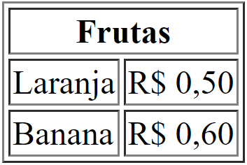

<style>
img[alt~="center"] {
    display: block;
    margin: 0 auto;
}
</style>

<!-- _paginate: false -->
# **Desenvolvimento de Sistemas para a Web I**

## Capítulo 2 - HTML

---

## HTML

- HyperText Markup Language (Linguagem de Marcação de Hipertexto)
- **Linguagem de marcação** utilizada na construção de páginas Web
- Uma **linguagem de marcação** é um conjunto de sinais (tags) aplicados nos textos ou em dados para definir sua configuração e aparência em uma página Web
  - Exemplo: `<title>`Minha Página`</title>`

---

## Tags HTML

- São as **marcações** utilizadas na construção de páginas Web
- Estão inseridas entre os sinais `<` e `>`
- São divididas em tags de abertura e de fechamento. As de fechamento possuem uma `/` logo após o sinal de `<`
    - Exemplo: `<h1>` (tag de abertura) e `</h1>` (tag de fechamento)
- Nem todas as tags possuem tag de fechamento (self-closing)
    - Exemplos: `<br>`, `<hr>`, ``, etc.

---

## Tags HTML

- Podem apresentar atributos nas tags de abertura
  - Os atributos são no formato `nome="valor"`
    - Exemplo: ``

---

## Principais Tags do HTML

- `<!DOCTYPE html>`
  - Ativa o *full standards mode* do HTML5 no documento
  - Se não utilizado, o navegador utiliza o *quirks mode*, layout que emula o comportamento não-padrão do Netscape Navigator 4 e do Internet Explorer 5 para Windows que é requerido para não quebrar o conteúdo existente na Web
  - Deve ser a primeira tag do documento HTML

---

## Principais Tags do HTML

- `<html>`...`</html>`
  - Representa a raiz de um documento HTML. Todos os outros elementos devem ser descendentes desse elemento
- `<head>`...`</head>`
  - Providencia *metadados* sobre o documento, incluindo seu título e links para scripts e folhas de estilos
  - Metadados são informações sobre o próprio documento
- `<body>`...`</body>`
  - Representa o conteúdo de um documento HTML

---

## Principais Tags do HTML

- `<meta>`
  - Define qualquer informação de metadados que não podem ser definidos por outros elementos HTML
  - Exemplo: `<meta charset="UTF-8">` define que a codificação do documento é UTF-8
- `<title>`...`</title>`
  - Define o título do documento, mostrado na barra de título de um navegador ou na aba da página HTML
  - Exemplo: `<title>`Minha Página`</title>`

---

## Principais Tags do HTML

- `<br>`
  - Produz uma quebra de linha em um texto (carriage-return)
  - Exemplo: Aqui tem `<br>` uma quebra

             Aqui tem
             uma quebra

---

## Principais Tags do HTML

- `<h1>`...`</h1>`, `<h2>`...`</h2>`, `<h3>`...`</h3>`, `<h4>`...`</h4>`, `<h5>`...`</h5>` e `<h6>`...`</h6>`
  - Representam seis níveis de título de seção. `<h1>` é o nível de seção maior e `<h6>` é o menor
  - Exemplos:
    `<h1>`Título 1`</h1>`
    ...
    `<h6>`Título 6`</h6>`
  

---

## Principais Tags do HTML

- `<em>`...`</em>`
  - Indica ênfase ou estresse ao texto
  - Exemplo: Anim in exercitation *Lorem occaecat* incididunt ipsum
- `<strong>`...`</strong>`
  - Indica importância ao texto
  - Exemplo: Anim in exercitation **Lorem occaecat** incididunt ipsum

---

## Principais Tags do HTML

- `<mark>`...`</mark>`
  - Indica relevância ao texto
  - Exemplo: 
- `<cite>`...`</cite>`
  - Cita o nome de um trabalho, tal como um livro, jogo ou música
  - Exemplo: Anim in exercitation *Lorem occaecat* incididunt ipsum

---

## Principais Tags do HTML

- `<dfn>`...`</dfn>`
  - Marca a instância de definição de um termo
  - Exemplo: Anim in exercitation *Lorem occaecat* incididunt ipsum
- `<em>`, `<cite>` e `<dfn>` parecem visualmente iguais, mas são *semanticamente* (significados) diferentes e podem assumir diferentes estilos

---

## Principais Tags do HTML

- `<p>`...`</p>`
  - Representa um parágrafo. São usados para agrupar conteúdos relacionados de qualquer tipo
  - Exemplo:
    ```html
    <p>Este é o primeiro parágrafo do texto. Este é o primeiro parágrafo do texto.
    Este é o primeiro parágrafo do texto. Este é o primeiro parágrafo do texto.</p>

    <p>Este é o segundo parágrafo do texto. Este é o segundo parágrafo do texto.
    Este é o segundo parágrafo do texto. Este é o segundo parágrafo do texto.</p>
    ```

---

## Principais Tags do HTML


---

## Principais Tags do HTML

- `<a>`...`</a>`
  - Cria uma hiperligação nas páginas web, arquivos, endereços de emails, ligações na mesma página ou endereços na URL
  - Exemplo:
    `<a href="https://www.ifpe.edu.br">IFPE</a>`
    [IFPE](https://www.ifpe.edu.br)
    `<a href="mailto:fabricio.cabral@ead.ifpe.edu.br">Email</a>`
    [Email](mailto:fabricio.cabral@ead.ifpe.edu.br)
    `<a href="tel:+123456789">Fone</a>`
    [Fone](tel:+123456789)

---

## Principais Tags do HTML

- ``
  - Representa a inserção de imagem no documento HTML
  - Exemplo: ``

     

---

## Principais Tags do HTML

- `<ul>`...`</ul>`
- Representa uma lista em que uma ordenação numérica e as suas posições são irrelevantes (desordenada)
- São exibidos com um marcador que pode ter várias formas, como um ponto, um círculo ou um quadrado
- O atributo `type` modifica o tipo de marcador (ou pode-se usar CSS)
  - `point` indica um ponto (padrão)
  - `circle` indica um círculo
  - `square` indica um quadrado

---

## Principais Tags do HTML

- Exemplo:
  ```html
  <ul>
    <li>Laranja</li>
    <li>Banana</li>
    <li>Uva</li>
  </ul>
  ```
- Laranja
- Banana
- Uva

---

## Principais Tags do HTML

- `<li>`...`</li>`
- Representa um item que faz parte de uma lista
- Deve estar contido em um elemento pai: uma lista ordenada (`<ol>`), uma lista desordenada (`<ul>`) , ou um menu (`<menu>`) e representa uma única entidade dessa lista

---

## Principais Tags do HTML

- `<ol>`...`</ol>`
  - Representa uma lista de itens ordenados
  - O atributo `type` indica o tipo de numeração:
    - `a` indica letras minúsculas
    - `A` indica letras maiúsculas
    - `i` indica algarismos romanos minúsculos
    - `I` indica algarismos romanos maiúsculos
    - `1` indica números (padrão)

---

## Principais Tags do HTML

- Exemplo:
  ```html
  <ol>
    <li>Um</li>
    <li>Dois</li>
    <li>Três</li>
  </ol>
  ```

  1. Um
  2. Dois
  3. Três

---

## Principais Tags do HTML

- `<b>`...`</b>`
  - Representa um intervalo de texto estilísticamente diferente do texto normal, sem transmitir qualquer importância ou relevância
  - Geralmente é usado para destacar palavras-chaves em um resumo, nomes de produtos em um comentário ou outros vãos de texto cuja a apresentação típica seria negrito
  - Exemplo: Anim in exercitation **Lorem occaecat** incididunt ipsum

---

## Principais Tags do HTML

- `<i>`...`</i>`
  - Representa uma parte do texto que é destacada do restante por algum motivo, por exemplo, termos técnicos, expressões de outros idiomas ou pensamentos de personagens fictícios
  - É apresentado com o uso do tipo "itálico"
  - Exemplo: Anim in exercitation *Lorem occaecat* incididunt ipsum

---

## Principais Tags do HTML

- `<hr>`
  - Representa uma quebra temática entre elementos de nível de parágrafo (por exemplo , uma mudança da cena de uma história, ou uma mudança de tema com uma seção). Nas versões anteriores do HTML, representava uma linha horizontal. Pode continuar sendo exibida como uma linha horizontal nos navegadores, mas agora está definida em termos semânticos, em vez de termos de apresentação
  - Exemplo: 

---

## Comentários HTML

- `<!-- Isto é um comentário de uma linha -->`
- ```html
  <!--
    Isto é um comentário
    de mais de uma
    linha
  -->
  ```

---

## Template Básico de uma Página (Emmet)

```html
<!DOCTYPE html>
<html lang="pt-br">
<head>
    <meta charset="UTF-8">
    <meta http-equiv="X-UA-Compatible" content="IE=edge">
    <meta name="viewport" content="width=device-width, initial-scale=1.0">
    <title>Título da Página</title>
</head>
<body>
</body>
</html>
```

---

## Charset

- Especifica a codificação dos caracteres de um documento HTML
- Permite que o navegador interprete a acentuação dos documentos corretamente
- O padrão HTML5 recomenda a utilização do conjunto de caracteres `UTF-8`, que cobre quase todos os caracteres e símbolos do mundo
- `<meta charset="UTF-8">`

---

## Internet Explorer

- `<meta http-equiv="X-UA-Compatible" content="IE=edge">`
- Esta `<meta>` é exclusiva para Internet Explorer (introduzido no IE8), e configura a página para ser renderizada como em outra versão do Internet Explorer
- O *quirks mode* faz o site ser interpretado como uma versão mais antiga do IE, o que pode fazer o site falhar, então ao ao usar `X-UA-Compatible` com o valor `IE=edge` ele vai forçar o navegador renderizar com a mais recente

---

## Viewport

- É a área visível do usuário de uma página web. Varia com o tipo de dispositivo: será menor em um celular do que em uma tela de computador
- Dá ao navegador instruções de como controlar as dimensões e o dimensionamento da página
- `<meta name="viewport" content="width=device-width, initial-scale=1.0">`
  - `width=device-width` configura a largura da página para seguir a largura da tela do dispositivo
  - `initial-scale=1.0` configura o nível de zoom inicial

---

## Viewport


---

## Principais Tags do HTML

- `<link>`
  - Define um relacionamento entre o documento atual e um recurso externo
  - É mais usado para vincular as folhas de estilo (CSS) externo
  - É utilizado também para adicionar um *favicon*
  - Exemplo:
    ```html
    <head>
      <link rel="stylesheet" href="estilos.css">
    </head>
    ```

---

## Favicon

- É uma pequena imagem exibida próximo ao título da página na aba do browser
- Como é uma pequena imagem, deve ser simples e com alto contraste
- Existem vários sites que ajudam a criar, como o [favicon.io](https://favicon.io/)
- Exemplo:
  ```html
  <head>
    <link rel="icon" type="image/png" href="favicon.png">
  </head>
  ```

---

## Principais Tags do HTML

- `<div>`...`</div>`
  - Define uma divisão ou uma seção em um documento HTML
  - É usado como contêiner para elementos HTML, que podem ser estilizados com CSS ou manipulados com JavaScript
  - Deve ser utilizado quando não tiver outro elemento de semântica, como `<article>` ou `<nav>`

---

## Principais Tags do HTML

- Exemplo:

    ```html
    <body>
    <div class="destacado">
      <h2>This is a heading in a div element</h2>
      <p>This is some text in a div element.</p>
    </div>
    </body>
    ```

---

## Principais Tags do HTML

- `<span>`...`</span>`
  - Define um contêiner inline para marcar parte de um texto ou de um documento
  - Pode ser estilizado com CSS ou manipulado com JavaScript usando o atributo `class` ou `id`
  - É muito parecido com a tag `<div>`, mas `<div>` é um elemento de bloco enquanto `<span>` é um elemento inline

---

## Principais Tags do HTML

  - Exemplo:
    ```html
    <body>
      <p>Meu carro é <span style="color:blue">azul</span> e o
      seu é <span style="color:red">vermelho</span>.</p>
    </body>
    ```

---

## Principais Tags do HTML

- `<table>`...`</table>`
  - Define uma tabela
- `<th>`...`</th>`
  - Define uma célula cabeçalho em uma tabela
- `<tr>`...`</tr>`
  - Define uma linha em uma tabela
- `<td>`...`</td>`
  - Define uma célula em uma tabela

---

## Principais Tags do HTML

- `<caption>`...`</caption>`
  - Define uma legenda (ou título) para uma tabela
- `<colgroup>`...`</colgroup>`
  - Especifica um grupo de uma ou mais colunas em uma tabela para formatação
- `<col>`...`</col>`
  - Especifica propriedades de coluna para cada coluna dentro de um elemento `<colgroup>`

---

## Principais Tags do HTML

- `<thead>`...`</thead>`
  - Agrupa o conteúdo do cabeçalho em uma tabela
- `<tbody>`...`</tbody>`
  - Agrupa o conteúdo do corpo em uma tabela
- `<tfoot>`...`</tfoot>`
  - Agrupa o conteúdo do rodapé em uma tabela

---

## Principais Tags do HTML

```html
<table border="1">
  <thead>
    <tr>
      <th>Fruta</th>
      <th>Preço</th>
    </tr>
  </thead>
  <tr>
    <td>Laranja</td>
    <td>R$ 0,50</td>
  </tr>
  <tr>
    <td>Banana</td>
    <td>R$ 0,60</td>
  </tr>
</table>

```

---

## Principais Tags do HTML


---

## Principais Tags do HTML

- É possível também expandir uma coluna ou linha utilizando, respectivamente, os atributos `colspan` e `rowspan`
- Exemplo (baseado no anterior):
  ```html
  <table border="1">
    <thead>
      <tr>
        <th colspan="2">Frutas</th>
      </tr>
    </thead>
    ...
  </table>
  ```

---

## Principais Tags do HTML



---

## Principais Tags do HTML

```html
<table border="1">
  ...
  <tr>
    <td>Laranja</td>
    <td rowspan="2">R$ 0,50</td>
  </tr>
  <tr>
    <td>Banana</td>
  </tr>
</table>
```

---

## Principais Tags do HTML


---

## Referências Bibliográficas

- MDN Web Docs, "Elementos HTML", https://developer.mozilla.org/pt-BR/docs/Web/HTML/Element, acessado em 05/04/2023
- MDN Web Docs, "<hr>", https://developer.mozilla.org/pt-BR/docs/Web/HTML/Element/hr, acessado em 05/04/2023
- MDN Web Docs, "", https://developer.mozilla.org/pt-BR/docs/Web/HTML/Element/img, acessado em 05/04/2023

---

## Referências Bibliográficas

- MDN Web Docs, "<h1>–<h6>: Os elementos HTML de cabeçalho da seção", https://developer.mozilla.org/pt-BR/docs/Web/HTML/Element/Heading_Elements, acessado em 05/04/2023
- MDN Web Docs, "\<br>", https://developer.mozilla.org/pt-BR/docs/Web/HTML/Element/br, acessado em 05/04/2023
- MDN Web Docs, "<head>", https://developer.mozilla.org/pt-BR/docs/Web/HTML/Element/head, acessado em 05/04/2023

---

## Referências Bibliográficas

- MDN Web Docs, "<html>", https://developer.mozilla.org/pt-BR/docs/Web/HTML/Element/html, acessado em 05/04/2023
- MDN Web Docs, "<body>", https://developer.mozilla.org/pt-BR/docs/Web/HTML/Element/body, acessado em 05/04/2023
- MDN Web Docs, "<title>", https://developer.mozilla.org/pt-BR/docs/Web/HTML/Element/title, acessado em 05/04/2023

---

## Referências Bibliográficas

- MDN Web Docs, "Quirks Mode e Standards Mode", https://developer.mozilla.org/pt-BR/docs/Web/HTML/Quirks_Mode_and_Standards_Mode, acessado em 05/04/2023
- MDN Web Docs, "<meta>", https://developer.mozilla.org/pt-BR/docs/Web/HTML/Element/meta, acessado em 05/04/2023
- MDN Web Docs, "<p>", https://developer.mozilla.org/pt-BR/docs/Web/HTML/Element/p, acessado em 05/04/2023

---

## Referências Bibliográficas

- MDN Web Docs, "<i>", https://developer.mozilla.org/pt-BR/docs/Web/HTML/Element/i, acessado em 05/04/2023
- MDN Web Docs, "<b>", https://developer.mozilla.org/pt-BR/docs/Web/HTML/Element/b, acessado em 05/04/2023
- W3Schools, "HTML Style Guide", https://www.w3schools.com/html/html5_syntax.asp, acessado em 05/04/2023

---

## Referências Bibliográficas

- MDN Web Docs, "<a>", https://developer.mozilla.org/pt-BR/docs/Web/HTML/Element/a, acessado em 05/04/2023
- W3Schools, "HTML <meta> charset Attribute", https://www.w3schools.com/tags/att_meta_charset.asp, acessado em 05/04/2023
- StackOverflow, "Qual é a função da meta tag "X-UA-Compatible" dentro do HTML?", https://pt.stackoverflow.com/questions/209593/qual-%c3%a9-a-fun%c3%a7%c3%a3o-da-meta-tag-x-ua-compatible-dentro-do-html, acessado em 05/04/2023

---

## Referências Bibliográficas

- MDN Web Docs, "<ul>", https://developer.mozilla.org/pt-BR/docs/Web/HTML/Element/ul, acessado em 05/04/2023
- MDN Web Docs, "<ol>", https://developer.mozilla.org/pt-BR/docs/Web/HTML/Element/ol, acessado em 05/04/2023
- MDN Web Docs, "<li>", https://developer.mozilla.org/pt-BR/docs/Web/HTML/Element/li, acessado em 05/04/2023

---

## Referências Bibliográficas

- MDN Web Docs, "<table>", https://developer.mozilla.org/pt-BR/docs/Web/HTML/Element/table, acessado em 11/04/2023
- MDN Web Docs, "<tr>", https://developer.mozilla.org/en-US/docs/Web/HTML/Element/tr, acessado em 11/04/2023
- MDN Web Docs, "<td>", https://developer.mozilla.org/en-US/docs/Web/HTML/Element/td, acessado em 11/04/2023

---

## Referências Bibliográficas

 - W3Schools, "HTML Tables", https://www.w3schools.com/html/html_tables.asp, acessado em 11/04/2023
 - W3Schools, "HTML Table Colspan & Rowspan", https://www.w3schools.com/html/html_table_colspan_rowspan.asp, acessado em 11/04/2023
 - W3Schools, "HTML <link> Tag", https://www.w3schools.com/tags/tag_link.asp, acessado em 11/04/2023

---

## Referências Bibliográficas

- W3Schools, "HTML Favicon", https://www.w3schools.com/html/html_favicon.asp, acessado em 11/04/2023
- favicon.io, "favicon.io", https://favicon.io, acessado em 11/04/2023
- W3Schools, "HTML <div> Tag", https://www.w3schools.com/tags/tag_div.asp, acessado em 11/04/2023

---

## Referências Bibliográficas

- MDN Web Docs, "<div>", https://developer.mozilla.org/pt-BR/docs/Web/HTML/Element/div, acessado em 11/04/2023
- W3Schools, "HTML <span> Tag", https://www.w3schools.com/tags/tag_span.asp, acessado em 11/04/2023


