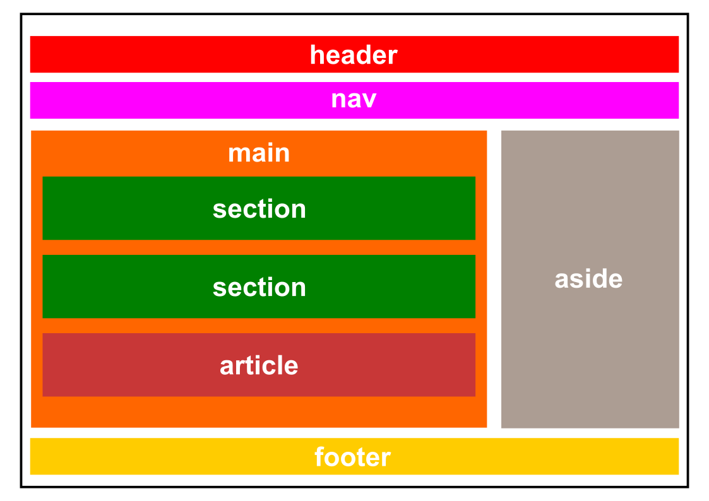

<style>
img[alt~="center"] {
    display: block;
    margin: 0 auto;
}
</style>

<!-- _paginate: false -->
# **Desenvolvimento de Sistemas para a Web I**

## Capítulo 3 - HTML Semântico

---

## Tag Semântica

- Um elemento (tag) semântico descreve claramente seu significado tanto para o navegador quanto para o desenvolvedor

---

## Estrutura das Tags Semânticas



---

## Tags Semânticas

- `<header>`...`</header>`
    - Representa um contêiner para conteúdo introdutório ou um conjunto de links navegacionais
    - Pode estar contido em vários elementos de um documento HTML
    - Tipicamente contém:
        - Um ou mais elementos de tópicos (`<h1>` a `<h6>`)
        - Logotipo ou ícone
        - Informação de autoria

---

## Tags Semânticas

- `<nav>`...`</nav>`
    - Define um conjunto se links navegacionais
    - Obs.: nem todos os links devem estar dentro das tags `<nav>`, apenas o principal bloco de links navegacionais
    - Exemplo:
        ```html
        <nav>
            <a href="/home/">Home</a> |
            <a href="/missao/">Missão</a> |
            <a href="/sobre/">Sobre</a>
        </nav>
        ```

---

## Tags Semânticas

- `<main>`...`</main>`
    - Especifica o principal conteúdo de um documento HTML
    - Deve ser único no documento
    - Não deve conter nenhum conteúdo que se repete em documentos, como barras laterais, links navegacionais, informação de copyright, logotipos e formulários de busca
    - Não pode estar contido nas tags `<article>`, `<aside>`, `<footer>`, `<header>` ou `<nav>`

---

## Tags Semânticas

- `<footer>`...`</footer>`
    - Define um rodapé para um documento ou seção
    - Tipicamente contém:
        - Informação de autoria, copyright ou contato
        - Mapa do site
        - Link "voltar para o topo"
        - Documentos relacionados

---

## Tags Semânticas

- `<section>`...`</section>`
    - Define uma *seção* em um documento
        - Uma *seção* é um agrupamento temático de conteúdo, geralmente com um título
    - Pode ser usado para:
        - Capítulos
        - Introdução
        - Novos itens
        - Informação de contato

---

## Tags Semânticas

- `<article>`...`</article>`
    - Especifica um conteúdo independente ou autônomo
    - Deve fazer sentido por si só e deve ser possível distribuí-lo independentemente do restante do site
    - Pode ser usado para:
        - Postagem de fóruns ou blogs
        - Comentários de usuários
        - Cards de produtos
        - Artigos de jornais

---

## Tags Semânticas

- Se `<section>` define uma seção em um documento e `<article>` especifica um conteúdo independente ou autônomo, como definimos quem contém quem?
    - Não definimos. `<section>` pode conter `<article>` e vice-versa

---

## Tags Semânticas

- `<aside>`...`</aside>`
    - Define algum conteúdo além do conteúdo em que é colocado (como uma barra lateral)
    - Deve estar indiretamente relacionado ao conteúdo circundante
    - Não usar para texto entre parenteses, pois este tipo de texto é considerado parte do fluxo principal

---

## Tags Semânticas

- Exemplo:

```html
<!DOCTYPE html>
<html>
<head>
    <title>Página com elemento aside</title>
</head>
<body>
    <aside style="background-color: lightgray; float: right;">
        <h2>Sobre nós</h2>
        <p>Somos uma companhia especializada em prover produtos e serviços de alta qualidade aos nosso clientes.</p>
        <p>Entre em contato conosco hoje!</p>
    </aside>
    <main>
        <h1>Bem-vindo ao nosso Website!</h1>
        <p>Obrigado por visitar nosso website. Nós esperamos que você encontre a informação que estava procurando.</p>
        <p>Por favor, sinta-se à vontade para entrar em contato se você tiver qualquer pergunta ou dúvida.</p>
    </main>
</body>
</html>
```

---

## Tags Semânticas

- Exemplo:

```html
<!DOCTYPE html>
<html>
    <head>
        <meta charset="UTF-8">
    </head>
<body>
    <header>
        <nav>
            <a href="/home/">Home</a> | <a href="/missao/">Missão<a> | <a href="/sobre/">Sobre</a>
        </nav>
    </header>
    <main>
        <h1>Bem-vindo ao nosso Website!</h1>
        <p>Obrigado por visitar nosso website. Nós esperamos que você encontre a informação que estava procurando.</p>
        <p>Por favor, sinta-se à vontade para entrar em contato se você tiver qualquer pergunta ou dúvida.</p>
    </main>
    <footer>Site desenvolvido por Fabrício Cabral. Todos os direitos reservados.</footer>
</body>
</html>
```

---

## Referências Bibliográficas

- W3Schools, "HTML Semantic Elements", https://www.w3schools.com/html/html5_semantic_elements.asp, acessado em 11/04/2023
- MDN Web Docs, "<aside>", https://developer.mozilla.org/en-US/docs/Web/HTML/Element/aside, acessado em 11/04/2023
