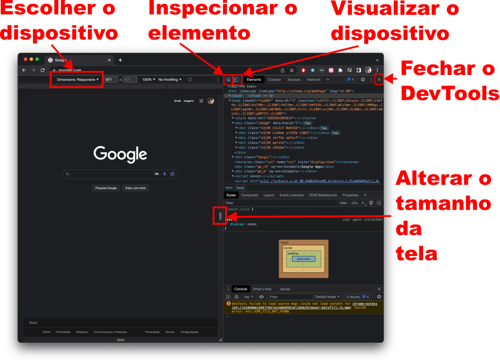

<!-- _paginate: false -->
# **Desenvolvimento de Sistemas para a Web I**

## Capítulo 6 - Chrome DevTools

---

## O que é?

- Ferramenta integrada de inspeção e depuração de páginas web
- Possibilita:
  - Escolher o tipo de dispositivo (celular, tablet, etc.)
  - Inspecionar os elementos HTML / estilos CSS
  - Alterar o tamanho da tela
  - Alterar os estilos CSS/elementos HTML da página temporariamente
  - Depurar código JavaScript, etc.

---

## Como Executar?

- Botão direito do mouse e escolher "Inspecionar"
- <kbd>F12</kbd> ou <kbd>Ctrl</kbd> + <kbd>Shift</kbd> + <kbd>I</kbd> (Windows)
- <kbd>Command</kbd> + <kbd>Option</kbd> + <kbd>I</kbd> (macOS)

---

## Tela Principal

---

## Referências Bibliográficas

- Chrome DevTools, "Chrome DevTools", https://developer.chrome.com/docs/devtools/, acessado em 08/05/2023